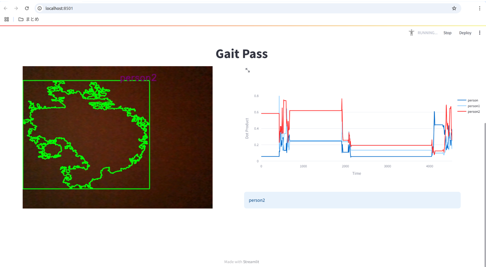
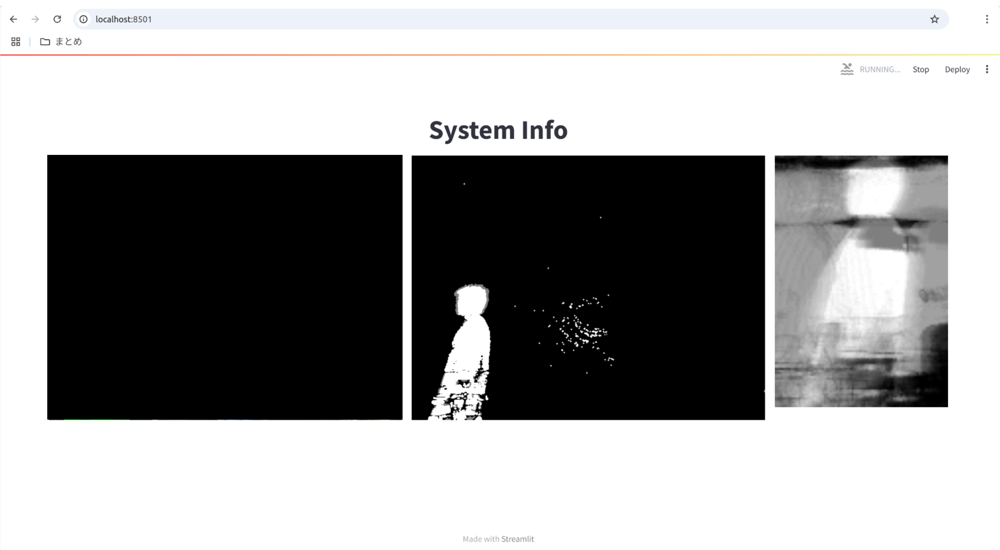
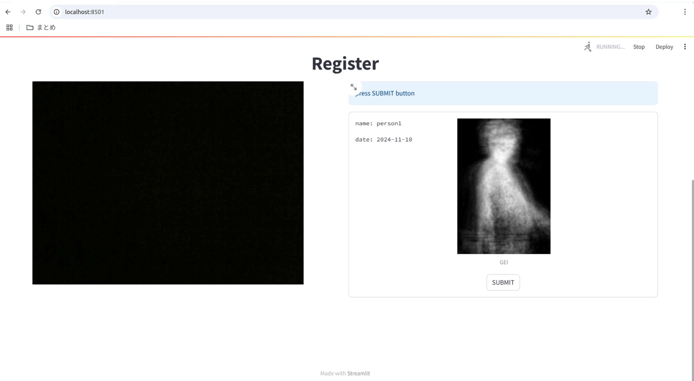
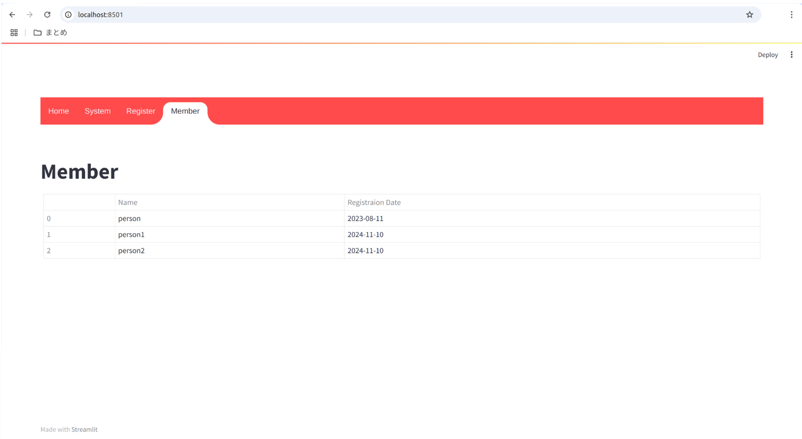

# GaitPass
人間の歩いている様子(歩容)から、個人を認証するシステムです。  
CNNベースのモデルを用いて、GEI画像から歩容特徴量を抽出し、ベクトルの類似度を用いて個人を判定します。

# 使い方
## 環境構築
```
pip install -r requirements.txt
```
## アプリの実行
```
streamlit run app.py
```

# 各画面
## Home
個人の認証結果をこの画面で表示します。  
右側のグラフは横軸が時間で縦軸が登録された人物ごとのconfidenceです。
登録された人物が通るとconfidenceが大きく変化します。


## System Info
どのようにシステムが動いているかを表示する画面です。  
左側の画像がカメラ画像で、真ん中の画像が人間だけを切り抜いた画像で、右側の画像が人間の動きを時間平均した画像です。


## Register
歩容認証システムにユーザーを登録する画面です。
歩いている容子を録画して計算した歩用特徴量をデータとして保存します。


## Member
登録されているユーザーを表示する画面です。

